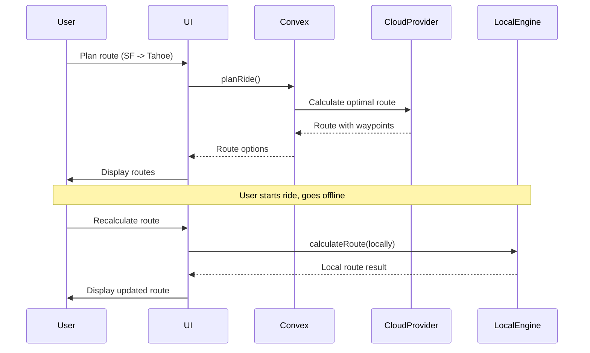
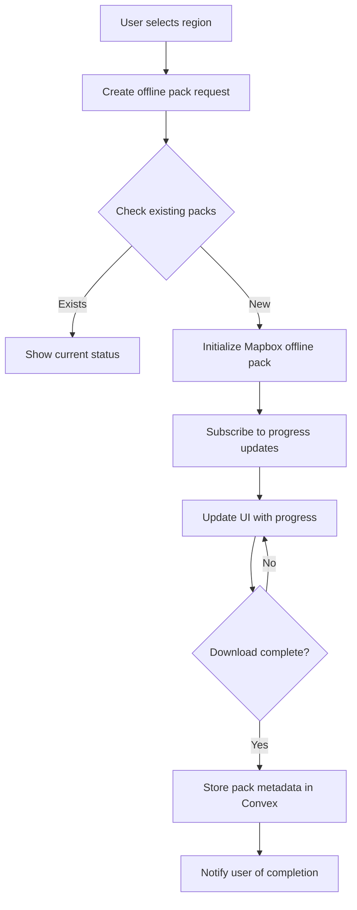
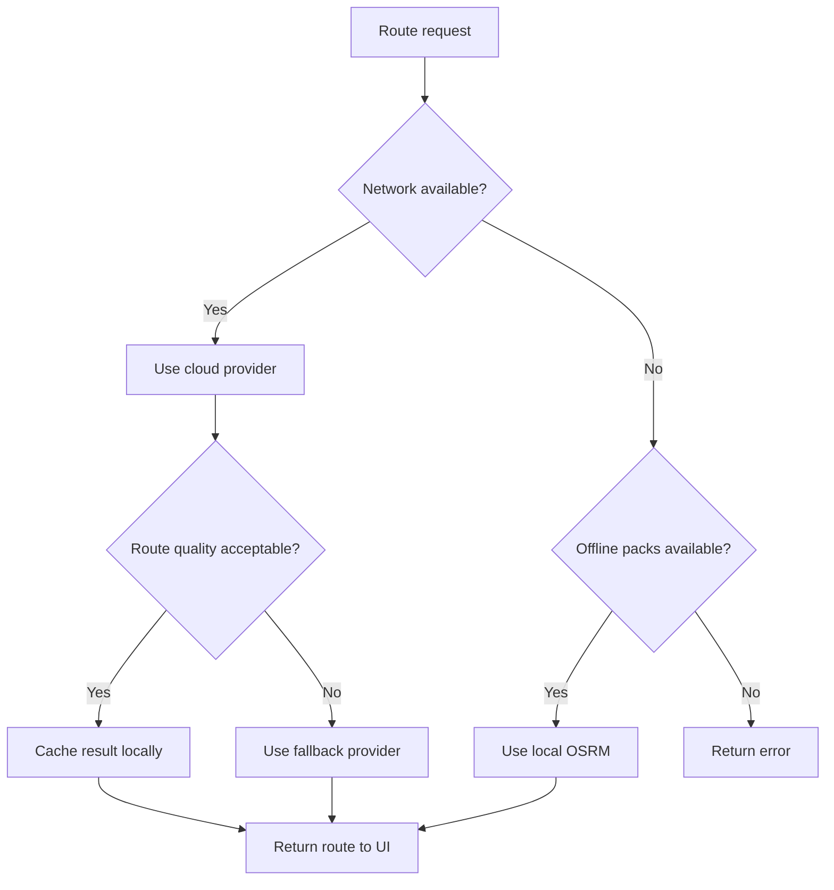
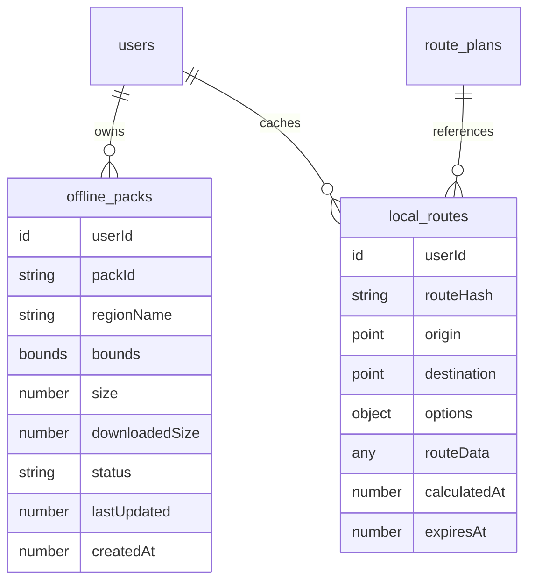

# Complete Local Routing - Technical Requirements

**Version**: 1.0
**Status**: Draft
**Related PRD**: Main PRD v1.0
**Related TRD**: See architecture sections below

## Executive Summary

This document defines the technical architecture for migrating from Google Maps to Mapbox SDK and implementing complete local routing capabilities for LaneShadow. The migration enables offline map downloads, local route calculation, and reduced dependency on cloud services while maintaining compatibility with React Native + Expo.

## 1. Architecture Overview by Entity

### 1.1 Map Provider Abstraction Layer

**Decision**: Create a provider abstraction to support multiple routing engines (Google, Mapbox, OSRM).

**Rationale**: 
- Enables gradual migration without breaking existing functionality
- Allows A/B testing of routing quality between providers
- Provides fallback mechanism if one provider fails
- Facilitates future additions (e.g., Valhalla for motorcycle-specific routing)

**Architecture**:
```typescript
// lib/routing/providers/provider.ts
export type RoutingProvider = 'google' | 'mapbox' | 'osrm'

export interface RoutingProviderInterface {
  calculateRoute(request: RouteRequest): Promise<RouteResponse>
  calculateAlternatives(request: RouteRequest): Promise<RouteResponse[]>
  routeSegment(segment: RouteSegment): Promise<RouteResponse>
}

export const createRoutingProvider = (
  type: RoutingProvider,
  config: ProviderConfig
): RoutingProviderInterface => {
  switch (type) {
    case 'google': return new GoogleRoutingProvider(config)
    case 'mapbox': return new MapboxRoutingProvider(config)
    case 'osrm': return new OSRMProvider(config)
  }
}
```

### 1.2 Offline Map Management

**Decision**: Use Mapbox SDK's offline pack system with progressive download management.

**Rationale**:
- Mapbox provides mature offline pack management for React Native
- Progressive downloads enable better UX (show download progress, pause/resume)
- Packs can be organized by region for targeted downloads
- Automatic update notifications when map data changes

**Architecture**:
```typescript
// lib/mapbox/offline-manager.ts
export interface OfflinePack {
  id: string
  region: MapRegion
  size: number
  downloadedSize: number
  status: 'inactive' | 'active' | 'complete' | 'unknown'
  progress: number
}

export const offlineManager = {
  listPacks(): Promise<OfflinePack[]>,
  downloadRegion(region: MapRegion): Promise<string>,
  pausePack(packId: string): Promise<void>,
  resumePack(packId: string): Promise<void>,
  deletePack(packId: string): Promise<void>,
  getPackProgress(packId: string): Promise<number>
}
```

### 1.3 Route Calculation Architecture

**Decision**: Hybrid approach - cloud for initial planning, local for recalculations and offline mode.

**Rationale**:
- Cloud providers (Google/Mapbox) have superior traffic and road data
- Local calculation enables offline operation and quick recalculations
- Hybrid approach balances quality with availability
- AsyncVLA pattern (from research) enables cloud-optimized routes with edge refinement

**Architecture**:


### 1.4 Data Entities

**Decision**: Extend Convex schema to support offline packs and local routing metadata.

**New Tables**:
```typescript
// offline_packs table
offline_packs: defineTable({
  userId: v.id('users'),
  packId: v.string(), // Mapbox pack identifier
  regionName: v.string(), // e.g., "San Francisco Bay Area"
  bounds: v.object({
    south: v.number(),
    west: v.number(),
    north: v.number(),
    east: v.number()
  }),
  size: v.number(), // Total pack size in bytes
  downloadedSize: v.number(),
  status: v.union(v.literal('downloading'), v.literal('complete'), v.literal('paused'), v.literal('error')),
  lastUpdated: v.number(),
  createdAt: v.number()
})
  .index('by_userId', ['userId'])
  .index('by_userId_and_status', ['userId', 'status'])

// local_routes table (cache for locally calculated routes)
local_routes: defineTable({
  userId: v.id('users'),
  routeHash: v.string(), // Hash of origin+destination+options
  origin: v.object({ lat: v.number(), lng: v.number() }),
  destination: v.object({ lat: v.number(), lng: v.number() }),
  options: v.object({
    avoidHighways: v.optional(v.boolean()),
    avoidTolls: v.optional(v.boolean()),
    scenicBias: v.optional(v.number())
  }),
  routeData: v.any(), // Serialized route geometry
  calculatedAt: v.number(),
  expiresAt: v.number()
})
  .index('by_userId', ['userId'])
  .index('by_routeHash', ['routeHash'])
```

## 2. Data Flow Diagrams

### 2.1 Offline Pack Download Flow



### 2.2 Route Calculation Flow (Hybrid)



## 3. Data Definitions

### 3.1 Mapbox Configuration

```typescript
// lib/mapbox/config.ts
export const MAPBOX_CONFIG = {
  // Public access token (client-side)
  publicAccessToken: process.env.EXPO_PUBLIC_MAPBOX_TOKEN,

  // Offline pack configuration
  packs: {
    styleURL: 'mapbox://styles/mapbox/outdoors-v12',
    minZoom: 10,
    maxZoom: 16,
    // Size limits per pack (Mapbox recommends < 50MB for UX)
    maxPackSize: 50 * 1024 * 1024
  },

  // Regional pack definitions (pre-configured areas)
  regions: [
    {
      id: 'sf-bay-area',
      name: 'San Francisco Bay Area',
      bounds: { north: 38.0, south: 37.0, east: -121.5, west: -123.0 }
    },
    {
      id: 'la-area',
      name: 'Los Angeles Area',
      bounds: { north: 34.5, south: 33.5, east: -117.5, west: -119.0 }
    }
  ]
} as const
```

### 3.2 Route Request/Response Types

```typescript
// types/routing.ts
export interface RouteRequest {
  origin: { lat: number; lng: number; name?: string }
  destination: { lat: number; lng: number; name?: string }
  waypoints?: Array<{ lat: number; lng: number; name?: string }>
  options: RouteOptions
}

export interface RouteOptions {
  avoidHighways?: boolean
  avoidTolls?: boolean
  scenicBias?: number // 0-1, higher = prefer scenic roads
  maxAlternatives?: number
}

export interface RouteResponse {
  provider: RoutingProvider
  routes: Route[]
  calculationTime: number
}

export interface Route {
  id: string
  geometry: RouteGeometry
  duration: number // seconds
  distance: number // meters
  legs: RouteLeg[]
  bounds: {
    north: number
    south: number
    east: number
    west: number
  }
}

export interface RouteGeometry {
  format: 'polyline' | 'geojson'
  encoding: 'google_encoded_polyline' | 'mapbox' | 'geojson'
  precision: number
  value: string | object // Encoded string or GeoJSON object
}

export interface RouteLeg {
  start: { lat: number; lng: number; name?: string }
  end: { lat: number; lng: number; name?: string }
  distance: number
  duration: number
  steps?: RouteStep[]
}

export interface RouteStep {
  instruction: string
  distance: number
  duration: number
  start: { lat: number; lng: number }
  end: { lat: number; lng: number }
}
```

## 4. Endpoint Definitions

### 4.1 Convex Functions (Backend)

#### Queries

```typescript
// convex/routing/queries.ts

// List user's downloaded offline packs
export const listOfflinePacks = query({
  args: { userId: v.id('users') },
  handler: async (ctx, { userId }) => {
    const packs = await ctx.db
      .query('offline_packs')
      .withIndex('by_userId_and_status', (q) => 
        q.eq('userId', userId).eq('status', 'complete')
      )
      .collect()
    return packs
  }
})

// Get cached local route
export const getLocalRoute = query({
  args: { 
    routeHash: v.string(),
    userId: v.id('users')
  },
  handler: async (ctx, { routeHash, userId }) => {
    const route = await ctx.db
      .query('local_routes')
      .withIndex('by_routeHash', (q) => 
        q.eq('routeHash', routeHash)
      )
      .first()
    
    if (!route) return null
    if (route.userId !== userId) return null // RLS check
    if (route.expiresAt < Date.now()) return null // Expired
    
    return route
  }
})
```

#### Mutations

```typescript
// convex/routing/mutations.ts

// Register offline pack download
export const registerOfflinePack = mutation({
  args: {
    userId: v.id('users'),
    packId: v.string(),
    regionName: v.string(),
    bounds: v.object({
      north: v.number(),
      south: v.number(),
      east: v.number(),
      west: v.number()
    })
  },
  handler: async (ctx, args) => {
    const packId = await ctx.db.insert('offline_packs', {
      ...args,
      size: 0,
      downloadedSize: 0,
      status: 'downloading',
      lastUpdated: Date.now(),
      createdAt: Date.now()
    })
    return packId
  }
})

// Update offline pack progress
export const updatePackProgress = internalMutation({
  args: {
    packId: v.id('offline_packs'),
    downloadedSize: v.number(),
    status: v.optional(v.union(
      v.literal('downloading'),
      v.literal('complete'),
      v.literal('paused'),
      v.literal('error')
    ))
  },
  handler: async (ctx, { packId, downloadedSize, status }) => {
    await ctx.db.patch(packId, {
      downloadedSize,
      ...(status && { status }),
      lastUpdated: Date.now()
    })
  }
})

// Cache locally calculated route
export const cacheLocalRoute = internalMutation({
  args: {
    userId: v.id('users'),
    routeHash: v.string(),
    origin: v.object({ lat: v.number(), lng: v.number() }),
    destination: v.object({ lat: v.number(), lng: v.number() }),
    options: v.object({
      avoidHighways: v.optional(v.boolean()),
      avoidTolls: v.optional(v.boolean()),
      scenicBias: v.optional(v.number())
    }),
    routeData: v.any()
  },
  handler: async (ctx, args) => {
    // Check for existing route
    const existing = await ctx.db
      .query('local_routes')
      .withIndex('by_routeHash', (q) => q.eq('routeHash', args.routeHash))
      .first()
    
    if (existing) {
      await ctx.db.patch(existing._id, {
        routeData: args.routeData,
        calculatedAt: Date.now(),
        expiresAt: Date.now() + (7 * 24 * 60 * 60 * 1000) // 7 days
      })
      return existing._id
    }
    
    // Insert new cache entry
    const routeId = await ctx.db.insert('local_routes', {
      ...args,
      calculatedAt: Date.now(),
      expiresAt: Date.now() + (7 * 24 * 60 * 60 * 1000)
    })
    return routeId
  }
})
```

#### Actions

```typescript
// convex/routing/actions.ts

// Calculate route with provider fallback
export const calculateRoute = action({
  args: {
    request: v.object({
      origin: v.object({ lat: v.number(), lng: v.number() }),
      destination: v.object({ lat: v.number(), lng: v.number() }),
      options: v.object({
        avoidHighways: v.optional(v.boolean()),
        avoidTolls: v.optional(v.boolean()),
        scenicBias: v.optional(v.number())
      })
    }),
    preferredProvider: v.optional(v.union(
      v.literal('google'),
      v.literal('mapbox'),
      v.literal('osrm')
    ))
  },
  handler: async (ctx, { request, preferredProvider }) => {
    const provider = preferredProvider || 'mapbox'
    
    try {
      const result = await routeWithProvider(provider, request)
      return { success: true, provider, result }
    } catch (error) {
      // Fallback chain: mapbox -> google -> osrm
      const fallbacks = ['mapbox', 'google', 'osrm'].filter(p => p !== provider)
      
      for (const fallback of fallbacks) {
        try {
          const result = await routeWithProvider(fallback, request)
          return { success: true, provider: fallback, result }
        } catch (fallbackError) {
          console.warn(`Fallback provider ${fallback} failed:`, fallbackError)
        }
      }
      
      throw new Error('All routing providers failed')
    }
  }
})
```

### 4.2 React Native Components (Frontend)

#### MapView Integration

```typescript
// components/map/MapView.tsx
import MapboxGL from '@rnmapbox/maps'

interface MapViewProps {
  initialRegion?: MapRegion
  route?: Route
  offlinePacks?: OfflinePack[]
  onRegionChange?: (region: MapRegion) => void
  style?: any
}

export const MapView: React.FC<MapViewProps> = ({
  initialRegion,
  route,
  offlinePacks,
  onRegionChange,
  style
}) => {
  return (
    <MapboxGL.MapView
      style={style}
      styleURL={MapboxGL.StyleURL.Outdoors}
    >
      <MapboxGL.Camera
        zoomLevel={10}
        centerCoordinate={[
          initialRegion?.longitude || -122.4,
          initialRegion?.latitude || 37.8
        ]}
      />
      
      {route && (
        <MapboxGL.ShapeSource
          id="route-source"
          shape={convertRouteToGeoJSON(route)}
        >
          <MapboxGL.LineLayer
            id="route-line"
            style={{
              lineColor: '#3B82F6',
              lineWidth: 4,
              lineOpacity: 0.8
            }}
          />
        </MapboxGL.ShapeSource>
      )}
    </MapboxGL.MapView>
  )
}
```

#### Offline Pack Manager UI

```typescript
// components/map/OfflinePackManager.tsx
interface OfflinePackManagerProps {
  userId: string
}

export const OfflinePackManager: React.FC<OfflinePackManagerProps> = ({ userId }) => {
  const [packs, setPacks] = useState<OfflinePack[]>([])
  const [downloading, setDownloading] = useState<string | null>(null)
  const [progress, setProgress] = useState<Record<string, number>>({})

  const downloadRegion = async (region: MapRegion) => {
    const packName = `${region.north}-${region.south}-${region.east}-${region.west}`
    setDownloading(packName)

    try {
      // Initialize Mapbox offline pack
      const pack = await MapboxGL.offlineManager.createPack({
        styleURL: MapboxGL.StyleURL.Outdoors,
        minZoom: 10,
        maxZoom: 16,
        bounds: [[region.west, region.south], [region.east, region.north]]
      }, (progress, error) => {
        if (error) {
          console.error('Download error:', error)
          setDownloading(null)
          return
        }
        
        setProgress(prev => ({
          ...prev,
          [packName]: progress.percentage
        }))
        
        if (progress.percentage === 100) {
          // Register pack in Convex
          registerOfflinePack({
            userId,
            packId: packName,
            regionName: `Region ${packName}`,
            bounds: region
          })
          setDownloading(null)
        }
      })
    } catch (error) {
      console.error('Failed to download region:', error)
      setDownloading(null)
    }
  }

  return (
    <View>
      {/* Region selector and download buttons */}
      {/* Progress indicators for active downloads */}
      {/* List of downloaded packs with delete options */}
    </View>
  )
}
```

## 5. Database Diagram



## 6. UI Requirements

### 6.1 Screen Inventory

1. **Offline Map Settings** (`app/map/offline.tsx`)
   - List available regions
   - Show download progress
   - Display downloaded packs
   - Delete pack functionality

2. **Map View** (Enhanced)
   - Show offline availability indicator
   - Graceful degradation when offline
   - Cached route display
   - Local recalculation option

3. **Route Options** (Enhanced)
   - Provider selection (auto/google/mapbox)
   - Offline mode toggle
   - Cache preferences

### 6.2 Component Requirements

#### OfflineStatusIndicator

```typescript
// components/map/OfflineStatusIndicator.tsx
interface OfflineStatusIndicatorProps {
  hasOfflineMaps: boolean
  region?: string
  onPress?: () => void
}

// Shows:
// - Green checkmark when offline maps available
// - Warning when region not downloaded
// - Download button on press
```

#### RouteProviderSelector

```typescript
// components/routing/ProviderSelector.tsx
interface ProviderSelectorProps {
  selected: RoutingProvider | 'auto'
  onChange: (provider: RoutingProvider | 'auto') => void
  disabled?: boolean
}

// Shows radio buttons for provider selection
// "Auto" lets system choose based on availability
```

## 7. Validation Rules

### 7.1 Business Logic Constraints

1. **Offline Pack Size Limits**
   - Single pack < 50MB (Mapbox recommendation)
   - Total per user < 500MB (storage constraint)
   - Alert user before exceeding limits

2. **Route Cache Expiry**
   - Local routes expire after 7 days
   - Clear expired cache on app launch
   - Manual clear option in settings

3. **Provider Fallback Logic**
   - Try preferred provider first
   - Fallback order: Mapbox → Google → OSRM
   - Timeout after 10 seconds per provider
   - Return error if all fail

4. **Network Awareness**
   - Check network status before routing
   - Use offline mode if no network
   - Queue cloud requests for later
   - Sync when connection restored

## 8. Error Handling

### 8.1 User-Facing Errors

```typescript
// lib/routing/errors.ts
export class RoutingError extends Error {
  constructor(
    message: string,
    public code: ErrorCode,
    public recoverable: boolean = false
  ) {
    super(message)
  }
}

export enum ErrorCode {
  NO_NETWORK = 'NO_NETWORK',
  NO_OFFLINE_MAPS = 'NO_OFFLINE_MAPS',
  PROVIDER_TIMEOUT = 'PROVIDER_TIMEOUT',
  ALL_PROVIDERS_FAILED = 'ALL_PROVIDERS_FAILED',
  PACK_DOWNLOAD_FAILED = 'PACK_DOWNLOAD_FAILED',
  INSUFFICIENT_STORAGE = 'INSUFFICIENT_STORAGE'
}

// Error messages
export const ERROR_MESSAGES: Record<ErrorCode, string> = {
  NO_NETWORK: 'No internet connection. Please download offline maps or check your connection.',
  NO_OFFLINE_MAPS: 'No offline maps for this region. Download maps to use routing offline.',
  PROVIDER_TIMEOUT: 'Route calculation timed out. Please try again.',
  ALL_PROVIDERS_FAILED: 'Unable to calculate route. Please check your connection.',
  PACK_DOWNLOAD_FAILED: 'Failed to download offline maps. Please try again.',
  INSUFFICIENT_STORAGE: 'Not enough storage space. Please free up space and try again.'
}
```

### 8.2 Error Recovery Strategies

1. **Network Errors**
   - Switch to offline mode if maps available
   - Queue request for later sync
   - Offer retry with different provider

2. **Storage Errors**
   - Delete oldest cache entries
   - Prompt user to manage storage
   - Continue with reduced functionality

3. **Provider Errors**
   - Automatic fallback to next provider
   - Log error for monitoring
   - Notify user of degraded service

## 9. Performance Considerations

### 9.1 Query Optimization

1. **Offline Pack Queries**
   - Index by `userId` and `status` for fast lookups
   - Limit to active/complete packs
   - Paginate list if > 100 packs

2. **Route Cache**
   - Hash-based lookup for O(1) cache hits
   - TTL-based expiry for freshness
   - LRU eviction when cache full

3. **Provider Selection**
   - Cache provider availability status
   - Track provider latency/performance
   - Prefer fastest provider for subsequent requests

### 9.2 Write Patterns

1. **Progress Updates**
   - Batch updates (every 5% progress)
   - Debounce rapid updates
   - Use internal mutations for speed

2. **Cache Writes**
   - Upsert pattern (insert or update)
   - Check for existing entry first
   - Background cache warming for common routes

### 9.3 Bandwidth Optimization

1. **Progressive Downloads**
   - Download low-zoom tiles first
   - Progressive detail enhancement
   - Pause/resume capability

2. **Delta Updates**
   - Check for pack updates (not full redownload)
   - Date-based versioning
   - Incremental tile updates

## 10. External Dependencies

### 10.1 Required Packages

```json
{
  "dependencies": {
    "@rnmapbox/maps": "^10.1.0", // Mapbox SDK for React Native
    "pmtiles": "^4.4.0", // Already installed - PMTiles support
    "@mapbox/polyline": "^1.2.1", // Already installed - Polyline encoding
    "@react-native-async-storage/async-storage": "^2.2.0", // Local cache
    "@react-native-community/netinfo": "^11.0.0" // Network detection
  }
}
```

### 10.2 Environment Variables

```bash
# .env.local (Convex)
MAPBOX_ACCESS_TOKEN=pk.xxx... # Public token for client
MAPBOX_SECRET_TOKEN=sk.xxx... # Secret token for server-side operations

# app.config.js (Expo)
EXPO_PUBLIC_MAPBOX_TOKEN=pk.xxx...
```

### 10.3 External APIs

#### Mapbox APIs

**Documentation**: https://docs.mapbox.com/api/navigation/

**Directions API** (Primary routing)
- Endpoint: `https://api.mapbox.com/directions/v5/mapbox/driving/{coordinates}`
- Auth: `access_token` query parameter
- Rate Limit: 300 requests/minute (free tier)
- Response Format: GeoJSON with polyline geometry

**Offline Packs** (Client-side)
- SDK: `@rnmapbox/maps`
- Methods: `offlineManager.createPack()`, `offlineManager.getPacks()`
- Storage: Device filesystem
- Size Limits: 50MB per pack recommended

**Alternative: OSRM** (Open Source)
- Self-hosted option for complete offline capability
- Documentation: http://project-osrm.org/docs/v5.24.0/api/
- Requires hosting infrastructure (not in MVP)

### 10.4 Migration Path

**Phase 1: Mapbox Integration** (Sprint X)
1. Install `@rnmapbox/maps`
2. Configure Mapbox tokens
3. Replace `react-native-maps` with Mapbox GL
4. Implement offline pack manager UI
5. Test offline functionality

**Phase 2: Provider Abstraction** (Sprint Y)
1. Create `RoutingProvider` interface
2. Implement Mapbox provider
3. Refactor Google provider to interface
4. Add provider selection UI
5. A/B testing framework

**Phase 3: Offline Routing** (Sprint Z)
1. Implement local route caching
2. Add network-aware routing
3. Progressive download management
4. Error handling and fallbacks
5. Performance optimization

## 11. Future Considerations

### 11.1 Not in MVP

1. **Valhalla Routing Engine**
   - Motorcycle-specific routing (curvature, elevation)
   - Self-hosted for complete offline
   - Requires infrastructure investment

2. **Traffic-Aware Routing**
   - Real-time traffic integration
   - Dynamic rerouting
   - Historical traffic patterns

3. **Elevation Profiles**
   - Visual elevation charts
   - Steepness warnings
   - Scenic route optimization

### 11.2 Migration Path

1. **Mapbox → Valhalla**
   - Start with Mapbox Directions API
   - Phase in Valhalla for offline-only scenarios
   - Eventually self-host for cost optimization

2. **Client → Server Routing**
   - MVP: Client-side routing calls
   - V2: Server-side aggregation for multi-stop routes
   - V3: Hybrid (cloud planning + edge refinement)

3. **Caching Strategy**
   - MVP: Simple TTL cache
   - V2: Smart invalidation (traffic, road closures)
   - V3: Predictive pre-caching

## 12. Success Metrics

### 12.1 Technical Metrics

| Metric | Target | Measurement |
|--------|--------|-------------|
| Route calculation time | <3s (cloud), <10s (offline) | Timing logs |
| Offline map download speed | >1MB/s (4G) | Progress tracking |
| Cache hit rate | >40% | Query analytics |
| Provider fallback rate | <5% | Error tracking |
| Offline route success rate | >90% | Usage analytics |

### 12.2 User Experience Metrics

| Metric | Target | Measurement |
|--------|--------|-------------|
| Offline pack adoption | >30% of active users | Pack downloads |
| Offline mode usage | >20% of routes | Analytics events |
| Route recalculation rate | <10% of planned routes | User behavior |
| Storage management | <5% delete packs | Retention analysis |

## Appendix A: Mapbox vs Google Comparison

| Feature | Google Maps | Mapbox |
|---------|-------------|---------|
| Offline Support | Limited (areas only) | Full packs with UI |
| Pricing | $7/1000 requests | $0-100k requests free |
| React Native Support | react-native-maps | @rnmapbox/maps |
| Custom Styles | Limited | Full customization |
| Motorcycle Routing | No | No (use OSRM) |
| Data Freshness | Real-time | Daily updates |

## Appendix B: Implementation Checklist

### Backend (Convex)
- [ ] Add `offline_packs` table to schema
- [ ] Add `local_routes` table to schema
- [ ] Implement `listOfflinePacks` query
- [ ] Implement `registerOfflinePack` mutation
- [ ] Implement `updatePackProgress` mutation
- [ ] Implement `cacheLocalRoute` mutation
- [ ] Implement `calculateRoute` action with fallback

### Frontend (React Native)
- [ ] Install `@rnmapbox/maps`
- [ ] Configure Mapbox tokens
- [ ] Replace MapView with Mapbox GL
- [ ] Implement `OfflinePackManager` component
- [ ] Add offline status indicators
- [ ] Implement network-aware routing
- [ ] Add provider selection UI
- [ ] Implement route caching
- [ ] Add error handling and fallbacks

### Testing
- [ ] Unit tests for routing provider interface
- [ ] Integration tests for offline pack management
- [ ] E2E tests for route calculation flow
- [ ] Performance tests for cache hit rates
- [ ] Manual testing on physical devices

---

**Next Steps**:
1. Review and approve technical architecture
2. Create sprint breakdown for implementation
3. Set up Mapbox account and tokens
4. Begin Phase 1: Mapbox Integration
